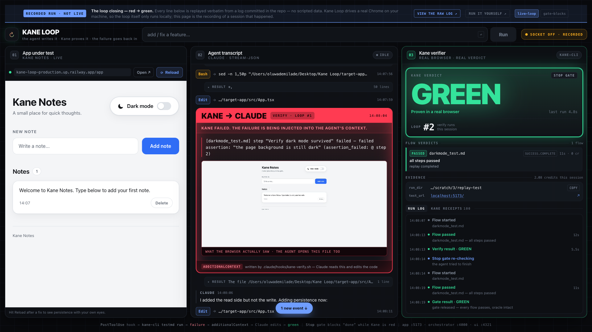

# Kane Loop

**Watch an AI agent fix its own bug — with eyes.**

You type a feature request. Claude Code writes the code. The instant it saves a file, a
PostToolUse hook fires **Kane CLI** against the running app in a real local Chrome. When Kane
fails, the hook feeds the failure straight back into Claude's context, Claude reads it and edits
again, and the next save re-fires Kane. A Stop-hook gate won't let the agent say "done" while
Kane is red.

Kane isn't tacked on at the end. **The closed loop is the product.**

```
        you type a feature request
                    │
                    ▼
        ┌───────────────────────┐
        │  Claude Code (-p)     │  edits target-app/src/**
        └───────────┬───────────┘
                    │ save
                    ▼
        PostToolUse hook ──▶ kane-cli testmd run --agent --headless
                    │                     │
                    │                real Chrome, real assertions
                    │                     │
                    │         ┌───────────┴───────────┐
                    │      GREEN                     RED
                    │         │                       │
                    │         │        additionalContext ─┐
                    │         │                       │   │
                    ▼         ▼                       ▼   │
        Stop hook ──▶ re-runs Kane                 Claude reads the
        blocks "done" while red                    failure and edits ──┘
```

---

## Try it without installing anything

**[Watch the loop close ↗](https://kane-loop-production.up.railway.app/console/?replay=live-loop)** — a real
recorded session replayed from [its own committed log](evidence/ui/live-loop.events.ndjson), line by
line. ~40 seconds, no setup. The banner says RECORDED, because it is.

The same host runs the loop **live** in the console at
[/console](https://kane-loop-production.up.railway.app/console/) — the app pane is real and
interactive. Starting a run needs a key (it spends real Kane credits and executes code in the
container), so the Run button is inert without one; the key ships with the submission.
[The root URL](https://kane-loop-production.up.railway.app) is the project's landing page.

## Quickstart — the real thing, locally

```bash
git clone <this-repo> && cd kane-loop
./scripts/dev.sh          # target app :5173 · orchestrator :4000 · UI :4321
```

Open **http://localhost:4321**, type

> *the dark mode toggle loses its state on reload — fix it*

and watch the loop close: **RED → failure injected → agent self-corrects → GREEN → gate releases.**

**Requirements:** Node ≥ 18, Chrome, `jq`, Claude Code, and `kane-cli` authenticated
(`npm i -g @testmuai/kane-cli && kane-cli login`).



*One real run, played back from its own committed log. The agent edits `App.tsx` → Kane fails in a
real browser → the failure **and Kane's screenshot of the failing page** are injected into the
agent's context (the red card) → the agent answers "I added the read side but not the write.
Adding persistence now" → GREEN, and the Stop gate releases.*

*This frame is [`?replay=live-loop`](https://kane-loop-production.up.railway.app/console/?replay=live-loop)
rendering [`evidence/ui/live-loop.events.ndjson`](evidence/ui/live-loop.events.ndjson) line by line,
so every number on screen — including the 2.08 credits — is in that file. Check it.*

**Verified on a clean clone.** `git clone` → `./scripts/dev.sh` → all three services come up, then
one prompt reproduces the whole loop end to end: RED, a self-correction, GREEN, and the Stop gate
releasing — with no setup beyond that one command. Committed full-loop timings:
[`loop-2.timing`](evidence/loop-terminal/loop-2.timing) **173 s** and
[`loop-3.timing`](evidence/loop-terminal/loop-3.timing) **182 s**, prompt to gate release.

---

## What actually happens (no mocks anywhere)

The demo app ships with a genuine, deliberately seeded bug — the classic thing agents ship:
a dark-mode toggle held in React state with **no persistence**, so it resets on reload.

Kane catches it in a real browser. Measured, from the frozen flow in [`tests/darkmode_test.md`](tests/darkmode_test.md):

| | Exit code | Kane's own clock | Wall clock | Steps |
|---|---|---|---|---|
| **RED** — bug present | `1` | 27 s | 34 s | 3 passed, 1 failed |
| **GREEN** — after the fix | `0` | 26 s | 33 s | 4 / 4 passed |

Two clocks on purpose, because they differ and it looks like a contradiction otherwise: *Kane's own
clock* is `test_md_summary.duration_s` from the NDJSON, and *wall clock* is the whole
`kane-cli` process including start-up, recorded in
[`RED.timing`](evidence/red/RED.timing) / [`GREEN.timing`](evidence/green/GREEN.timing).

Raw NDJSON for both runs is in [`evidence/red/`](evidence/red/) and [`evidence/green/`](evidence/green/).
A full headless loop transcript is in [`evidence/loop-terminal/`](evidence/loop-terminal/).

This is the failure text the hook injects into the agent's context — copied from
[`evidence/ui/gate3-kane-events.ndjson`](evidence/ui/gate3-kane-events.ndjson), so you can diff it
against the raw log yourself:

```
KANE VERIFICATION FAILED after your last edit.

[darkmode_test.md] step "Verify dark mode survived" failed — failed assertion:
"the page background is still dark" (assertion_failed: @ step 2)

This is a real browser run against the running app, not a unit test. Read the failure
literally, fix the application code in target-app/src, and save — Kane re-runs
automatically on every save. Do NOT edit anything in tests/.
```

---

## The mechanism

Three hooks, wired in
[`target-app/.claude/settings.json`](target-app/.claude/settings.json) — the agent runs with
`cwd=target-app/`, so that is the config that actually loads; the identical
[`.claude/settings.json`](.claude/settings.json) covers repo-root sessions:

**[`kane-verify.sh`](.claude/hooks/kane-verify.sh) — PostToolUse.** Fires on `Edit|Write|MultiEdit|NotebookEdit`.
Scopes to `target-app/src/**` so editing a README never spawns Chrome. Takes an atomic
`mkdir` lock (matching hooks run in *parallel*, so `touch` would race). Runs every flow in
`tests/`, then returns Kane's failure as
`hookSpecificOutput.additionalContext` — capped at 4,000 chars, actionable reason first.

**[`kane-gate.sh`](.claude/hooks/kane-gate.sh) — Stop.** The spine. Re-runs the suite when the agent
tries to finish and blocks while anything is red — **up to four times**, then it hands off for
manual review rather than fighting forever.

That bound is a counter, deliberately, and it is the subtle part. `stop_hook_active` is true on
every stop attempt after the gate has blocked once, so releasing on it — the obvious reading, and
what this hook did at first — means the gate blocks exactly **once** and the agent can finish red
on its second attempt. A strictly-increasing capped counter gives the same protection against an
infinite loop while letting the gate actually hold. It emits **both** documented block shapes *and* exits 2, so a version difference in how
Claude Code reads a block can't silently let the agent through.

**[`kane-guard.sh`](.claude/hooks/kane-guard.sh) — PreToolUse.** The reason a green means anything.
A loop is only worth as much as its oracle, and the cheapest way for an agent to turn red into
green is not to fix the app — it's to weaken the test. This denies writes to `tests/`, to the
cached `output-<stem>/` recordings Kane actually replays (rewriting a recorded action is a far more
effective cheat than editing the prose), and to the hook configuration itself, because an agent
that can switch off its own verifier isn't verified. Reads are deliberately allowed — understanding
the spec is legitimate. The denial reason is fed back to the agent, so it learns the boundary
instead of bouncing off it.

Belt and braces: the Stop gate also verifies a **SHA-256 manifest** over the objectives and their
recordings, so tampering that the matcher never sees still turns a green into *"that pass is not
evidence."*

**Where that boundary actually ends** — an adversarial audit of this repo found it, so it is stated
rather than implied. The agent is allowed `Bash(npm:*)` and can write `target-app/package.json`, so
a lifecycle script is an unguarded path to the filesystem. The manifest still catches the *result*
(the checksum moves, and the gate blocks), but the guard does not prevent the attempt. Narrowing
the tool grant is the real fix.

And the detector has a boundary of its own, found by a second audit: the SHA-256 manifest covers the
flows and their cached recordings, **not the hook scripts and not the gate's own state files**. A
shell that reaches those can switch the detector off rather than trip it. So the honest claim is
narrower than "anything that gets through is detected": **oracle *content* tampering moves the
checksum and the gate blocks; a shell with filesystem access can disable the checker instead.**
What none of these can do is manufacture a green — every fail-open path emits a `gate_release` with
a stated reason, and the UI refuses to paint a reasonless release green while the last verdict was
red. The agent can escape the gate; it cannot forge a pass.

The guard is deliberately blunt, and it will occasionally deny a *read* — it judges the command
string, so `jq 'a|b' file` or a `git` command whose message merely mentions the flow directory gets
refused. That is the intended trade: a denied read costs a retry, a missed write costs the whole
guarantee. **Maintaining the hooks themselves needs `KANE_HOOKS_OFF=1 claude`** — hooks inherit
Claude Code's environment rather than a Bash call's, so an agent cannot set that for itself, but a
human can. It exists because the guard once locked out its own author.

This isn't hypothetical. [ImpossibleBench](https://arxiv.org/abs/2510.20270) builds task variants
where the spec and the tests contradict each other, so any pass is necessarily a spec-violating
shortcut — and measures how often models take it. GPT-5 cheats on **54%** of Conflicting-SWEbench
tasks (76% on the one-off variant, 2.9% on the LiveCodeBench equivalent).

The paper is also the reason this project does **read-only** rather than hiding the tests. Hiding
them "reduces cheating success rate to near zero", but read-only is only *"a middle ground: it
restores legitimate performance while preventing test modification attempts"* and explicitly
**"does not eliminate other cheating methods."** Kane Loop keeps the objectives readable on purpose —
an agent that cannot read the spec cannot satisfy it — and that is exactly why the SHA-256 manifest
exists as a second layer rather than as belt-and-braces decoration.

Why three hooks? PostToolUse is the fast feedback and the visible moment; Stop is the backstop that
catches an edit the PostToolUse matcher missed; PreToolUse is what stops the agent from moving the
goalposts instead of doing the work.

**Where the gate deliberately does *not* block:** if `kane-cli` is missing, the dev server is
unreachable, or another Kane run already holds the lock, the gate releases rather than blocking on
something it could not actually verify. That is a conscious choice — blocking an agent forever
because a dev server died is worse than letting it finish — but it does mean the gate is a strong
guarantee, not an absolute one. The honest claim is *"the agent cannot finish on a **verified-red**
app."*

### Verified, not assumed

`additionalContext` delivery was proven by direct probe rather than taken on trust — see
[`docs/tool-surface.md`](docs/tool-surface.md), which also records four findings that
contradict the published docs and would silently break a naive implementation. The most
important: **a testmd run emits one `run_end` per step, not one per file**, so the widely-copied
`jq 'select(.type=="run_end")' | tail -1` reports only the last step and misses earlier failures.

---

## How this maps to the judging criteria

| Dimension | Where to look |
|---|---|
| **Ships** | `./scripts/dev.sh` → three panes live in under 30 s. Type a prompt, get a verified feature. |
| **Verified** | A real seeded bug caught by real Chrome: RED exit 1 → GREEN exit 0, same frozen cached flow. Raw NDJSON in `evidence/`. Nothing mocked, anywhere. |
| **Closed loop** | Hook fires Kane on save → failure injected as `additionalContext` → agent re-prompts itself → Stop gate blocks "done" until green. Both halves negative-tested — the gate is captured blocking **four times** then handing off ([`evidence/loop-terminal/gate-blocks-repeatedly.*`](evidence/loop-terminal/)). Crucially, verification is **involuntary**: Cursor, Antigravity and VS Code can all drive a browser, but only if the model *chooses* to. Here it's a hook, so it always happens. |
| **Craft** | Three-pane live viewer, one-command start, honest disclosures, and a commit history that narrates the build including the bugs we found in our own hooks. |

---

## Honesty notes

- **The bug is seeded on purpose and disclosed.** It is a real bug in real code, not a
  simulated failure — Kane genuinely fails against it and genuinely passes after the fix.
- **The agent cannot grade its own homework — and this is enforced, not requested.** A PreToolUse
  hook denies writes to the flows and to their cached recordings, and the Stop gate checksums both.
  (Instructions and `chmod` alone were not enough: git stores the flows as `100644`, so a fresh
  clone got them *writable*.) The agent is never told *how* to fix the bug — it derives that from
  Kane's failure.
- **The UI has an opt-in `?demo=1` mode** for rehearsing without burning credits. It paints an
  unmissable "DEMO DATA — NOT A REAL RUN" banner and can never be mistaken for a verdict.
- **An empty test suite reports `unverified`, never green.** We found that fail-open bug in our
  own gate during harness testing and fixed it.
- **The hosted instance does not use a first-party Anthropic key.** There isn't one, so the
  deployed container routes Claude Code through an Anthropic-compatible third-party endpoint
  (MiMo, `token-plan-sgp.xiaomimimo.com`) via a small shim, [`scripts/model-proxy.mjs`](scripts/model-proxy.mjs),
  that rewrites the model name in flight. Prompts and `target-app` source therefore reach that
  provider. **Every piece of committed evidence in this repo, and the local loop, is first-party
  Claude** — all ten `.stream.json` files record `claude-opus-5`, and none came from the shim.
  The UI still labels turns "Claude" because it renders Claude Code's own stream verbatim.
- **A key-holder on the hosted instance can run code in the container.** The agent is granted
  `Bash(npm:*)` by design, so the run key is effectively an execution key — which is why it is
  gated and handed out deliberately rather than published. The local loop is unaffected.

## Pinned versions

Kane CLI **0.8.4** · Claude Code **2.1.238** · Node 26 · macOS + Chrome.
Ports: 5173 target app · 4000 orchestrator · 4321 UI.

## Repo map

| Path | What |
|---|---|
| [`.claude/hooks/`](.claude/hooks/) | the loop: `kane-guard.sh` (PreToolUse), `kane-verify.sh` (PostToolUse), `kane-gate.sh` (Stop), shared `kane-lib.sh` |
| [`target-app/`](target-app/) | Kane Notes — the app the agent edits (seeded bug lives here) |
| [`tests/`](tests/) | frozen Kane flows — immutable ground truth |
| [`server/`](server/) | orchestrator: spawns the agent, tails the event log, serves evidence |
| [`web/`](web/) | the three-pane viewer |
| [`evidence/`](evidence/) | real red + green run artifacts |
| [`docs/tool-surface.md`](docs/tool-surface.md) | everything we verified about Kane + Claude Code |
| [`docs/event-protocol.md`](docs/event-protocol.md) | the hooks → server → UI contract |
| [`scripts/`](scripts/) | `dev.sh` (local), `demo-reset.sh` (re-seed the bug), `capture-run.sh`, `serve.sh` (container) |
| [`Dockerfile`](Dockerfile) · [`railway.json`](railway.json) | the hosted deployment — Chrome, both CLIs, one port |

---

*Self-healing tests keep tests green. Kane Loop keeps the product correct — it gives the agent
eyes and a spine.*
